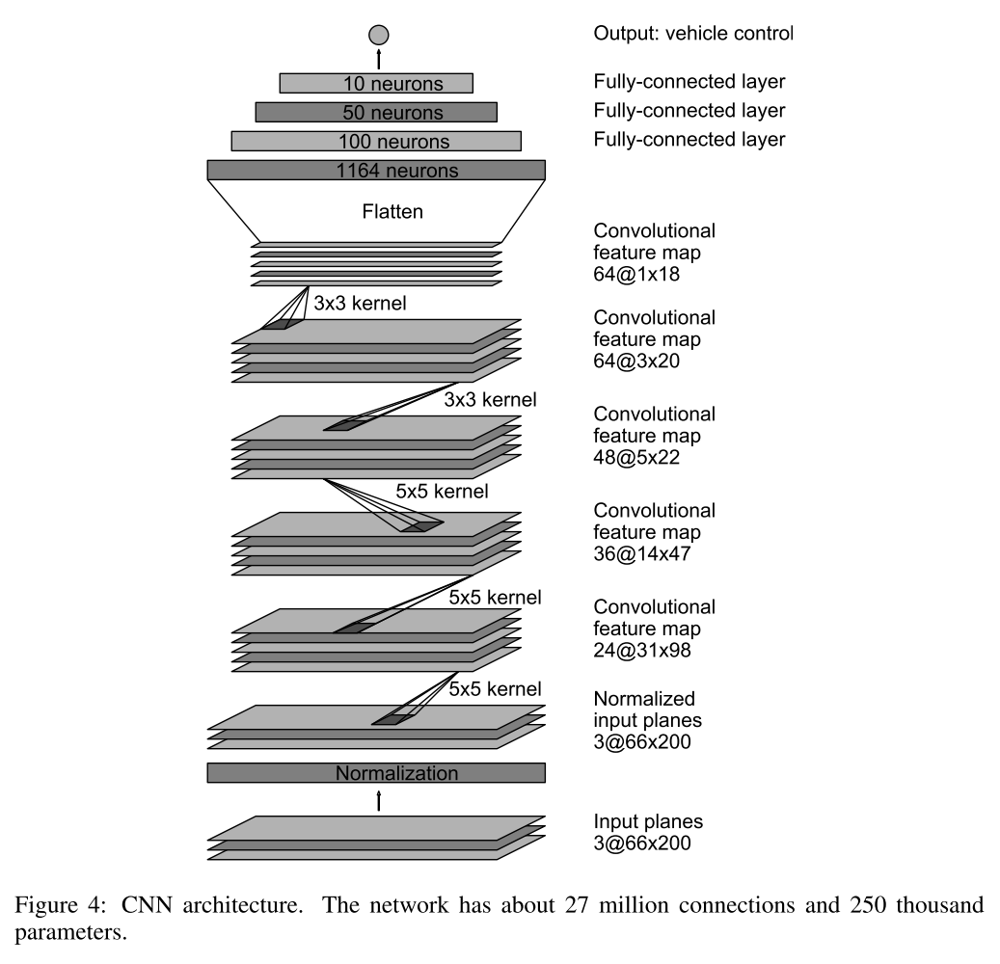
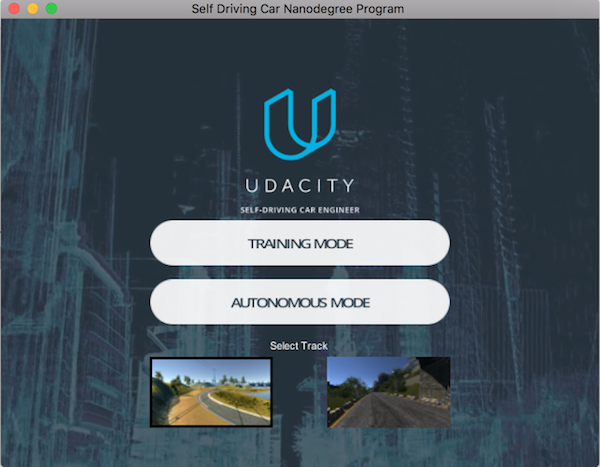

# Introduction

A trained Convolutional Neural Network based on this [NVIDIA paper](http://images.nvidia.com/content/tegra/automotive/images/2016/solutions/pdf/end-to-end-dl-using-px.pdf) for end-to-end driving in this Udacity simulator \([Linux](https://d17h27t6h515a5.cloudfront.net/topher/2017/February/58ae46bb_linux-sim/linux-sim.zip), [Mac](https://d17h27t6h515a5.cloudfront.net/topher/2017/February/58ae4594_mac-sim.app/mac-sim.app.zip), [Windows](https://d17h27t6h515a5.cloudfront.net/topher/2017/February/58ae4419_windows-sim/windows-sim.zip)\)

A visualization of NVIDIA network

A screenshot of Simulator

Mainly track-1 (the one on the left) was used for training and testing but trained model is well generalized so it also performs well on track-2 as well.

# Solution Design

I read the [NVIDIA paper](http://images.nvidia.com/content/tegra/automotive/images/2016/solutions/pdf/end-to-end-dl-using-px.pdf) and adapted their model architecture to my own data with some initial differences like 

- their last layer uses 'tanh' activation but I did not use that because I don't modify my target values like they do (y*1-2) and I wanted to keep things simple
- they use 150x150 image size but I have used 40x80 image size to preserve the aspect ratio of my data and using 150x150 resulted in much slower performance with not any significant decrease in MSE. I was able to achieve same results with 40x80 image sizes and it was much faster. 
- Due to image size change I have to change some of paddings from 'valid' to 'same' to run new image size 

After that I collected my own data using stable Simulator and trained this model. Car was able to drive to some distance with this training. Although it went off the road after some distance but I took it as a starting point and started collecting data for which the model was failing and also started changing the model a little bit. Most of the problems were sovled just by collecting data for which model actually was not knowledgable enough and rest were solved by adding a dropout layer. 

Reaching at this final dataset and training pipeline was not really easy for me as it involved a lot of hit and trial. At the end I would say that collecting the right data samples was key to solving this problem as I already knew the NVIDIA pipeline and I just had to learn what data should be fed to model. 

# Characteristics of the Model

This model which is adapted from NVIDIA auto-pilot cars paper based model consists of following layers

- Normalization layer with input shape = [?, 40, 80, 3]
- Convolution layer with 'relu' activation and 24, [5, 5] kernels, [2, 2] stride, padding=same
- Convolution layer with 'relu' activation and 36, [5, 5] kernels, [2, 2] stride, padding=same
- Dropout layer to avoid overfitting with 0.75 probability
- Convolution layer with 'relu' activation and 48, [5, 5] kernels, [2, 2] stride, padding=same
- Convolution layer with 'relu' activation and 64, [3, 3] kernels, [1, 1] stride, padding=valid
- Convolution layer with 'relu' activation and 64, [3, 3] kernels, [1, 1] stride, padding=valid
- Flatten layer
- Fully connected layer with 'relu' activation and with output neurons count=1164
- Fully connected layer with 'relu' activation and with output neurons count=100
- Fully connected layer with 'relu' activation and with output neurons count=50
- Fully connected layer with 'relu' activation and with output neurons count=10
- Output layer with output neurons count=1

So in total it uses total 13 layers:

- 1 Normalization layer
- 5 convolution layers each with 'relu' activation
- 4 fully connect layers each with 'relu' activation
- 1 Dropout layer with 0.75 probability
- 1 Flatten layer
- 1 output layer

# Other Details

- **Normalization** parameters were taken from NVIDIA paper and are exactly same as theirs. (epsilon=0.001, mode=2, axis=1)
- **Optimizer:** Adam has been used with default values
- **Loss function:** Mean Squared Error
- **batch size =** 128

To avoid memory problems keras data generators have been used along with fit_generator and evaluate_generator functions

# Model Training and Charactristics of dataset

I collectd all of data samples by driving car on stable version of simulator \([Linux](https://d17h27t6h515a5.cloudfront.net/topher/2017/February/58ae46bb_linux-sim/linux-sim.zip), [Mac](https://d17h27t6h515a5.cloudfront.net/topher/2017/February/58ae4594_mac-sim.app/mac-sim.app.zip), [Windows](https://d17h27t6h515a5.cloudfront.net/topher/2017/February/58ae4419_windows-sim/windows-sim.zip)\) and I used only center image. In total almost 42k samples was collected. Here is how I trained the model step by step.

- Model was was first trained on data set of 23777 samples collected by me doing a smooth driving on stable simulator version
- Model was then fine tunned on further 13k samples which also included 8k samples provided by Udacity. Model was fine-tunned instead of training from scrach because I was happy with my first model training and secondly my it was a performance issue for me as I had to wait a long amount of time to see final results.
- Model was then fine tunned on data set collected specially to avoid hitting bridge sides when crossing bridge.
- Finally model was trained on data set collected specially to avoid hitting different colored/types of road edges like red colored edges etc.

Overall data set included following types of samples

- Samples for smoooth driving like for example taking turns, running within lanes etc.
- Samples to avoid hitting bridge sides
- Samples to avoid road edges, this data included images to avoid almost all possible edges categories I was able to find.

# Getting Started Guide

- Please setup your Python environment first with [this start kit](https://github.com/udacity/CarND-Term1-Starter-Kit).

- Be sure to activate environment using command `source activate carnd-term1`.

- All code is written in Jupyter Notebook and each step is detailed and code is commented so running the Jupyter Notebook sequentially should work fine. Just make sure paths to training data are fine. After the code is executed, it will save **model** and **weights** in folder named _model_. Folder _model_ already contains python file `drive.py` which can be used to connect this saved model to simulator. 

## Testing on Simulator

- Activate starter kit environment using command `source activate carnd-term1`.
- Download simulator \([Linux](https://d17h27t6h515a5.cloudfront.net/topher/2017/February/58ae46bb_linux-sim/linux-sim.zip), [Mac](https://d17h27t6h515a5.cloudfront.net/topher/2017/February/58ae4594_mac-sim.app/mac-sim.app.zip), [Windows](https://d17h27t6h515a5.cloudfront.net/topher/2017/February/58ae4419_windows-sim/windows-sim.zip)\)
- Run simulator 
- Select Track1 (the one on left side)
- Now run your model server with command `python model/drive.py model.json`
- Car shoud start moving in simulator

# License 

This code is licensed under [MIT License](https://opensource.org/licenses/MIT)

